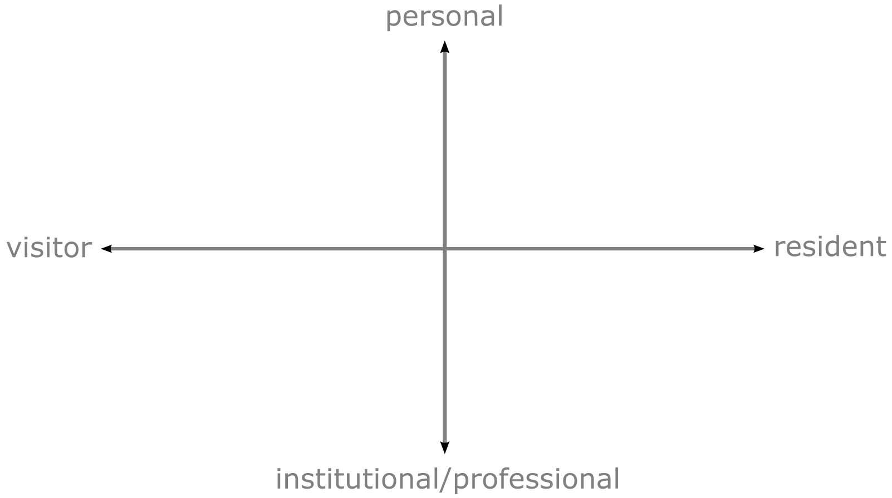
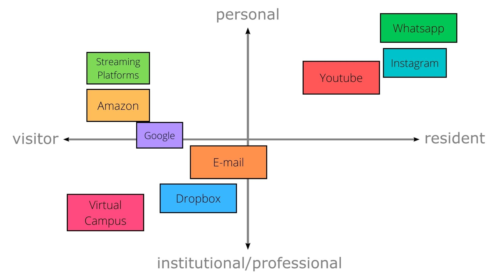
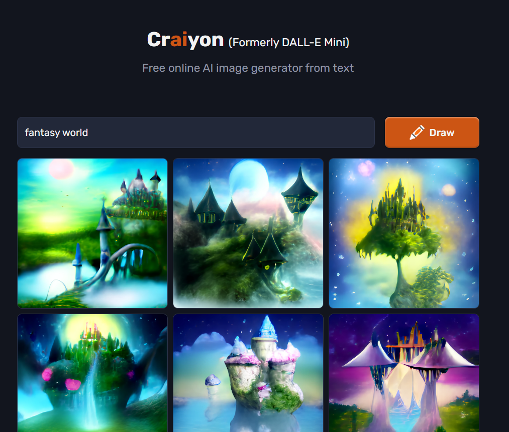

# A reflection on the Metaverse
## Introduction: Digital identities/Visitors and Residents

Years ago, Marc Prensky put forward the Digital Natives and Immigrants idea: If you are young enough to have grown up with digital technology, then you’re native to it. If not, using technology won’t be innate. In recent years, this theory has become obsolete. Age is not the predominant factor in the successful engagement with digital technology and the web. David White, from the University of Oxford, proposes an alternative model, the Visitor and Resident Map. One not based on age or technical skill, but on our motivation to engage (jiscnetskills, 2014).

First, we take a look horizontal axis. In this model, axes are a range of possibilities, not two incompatible options. The visitor mode thinks about the web as a compilation of tools for getting a particular job done; no social trace is left behind. For example, searching on a web browser. In the resident mode, we choose to go online to be present with other people; there is a social digital trace that remains when we go offline. For example, leaving comments on social media.

 

We also add a vertical axis: Personal – Institutional/Professional. This axis explains the degree of personal connection with the digital content. For example, personally I have two Gmail accounts, one related to university and the other for a more personal use.
As a student, I encountered this idea and I decided to create my own VR map. Here you can see the result:

The result really made me think about my relationship with the digital world and how it has evolved over the years. When I was a little kid, I used to search for the content I needed on the web without leaving any digital trace behind. Nowadays, it’s hard for me to think about an online activity where I don’t leave one. A clear example would be the social trace we leave when we interact with other people on social media, but the non-social content we access is also registered through user accounts and cookies. For example, a streaming platform can get an idea of my personality based on the content I choose to watch.

Although it’s true that not all my activities leave a digital trail that is equally accessible to the public, it is curious to see how the separation between physical and digital identity is blurring, as we are increasingly developing a traceable digital identity on the web. That led me to imagine a future in which this line blurs completely and about the possible dangers that such a change could mean for our existence.

Sometime later, while browsing the web, I came across a <a href="https://www.youtube.com/watch?v=Q01gSr6j9ZM&ab_channel=Aperture">Youtube video</a> [YouTube video](https://www.youtube.com/watch?v=Q01gSr6j9ZM&ab_channel=Aperture) that caught my attention. It talks about the Metaverse, a concept recently popularised by the CEO of Facebook, Mark Zuckerberg (Aperture, 2022). This video made me realize that the future I had imagined may not be far away, and encouraged me to try to answer the next question:

*How is the Metaverse a risk for the human experience?*

## What is the Metaverse?
We should first try to understand what is the Metaverse. A formal definition for it would be something like “a massive virtual environment parallel to the physical world, in which users interact through digital avatars” (Lee et al., 2021, p. 1). This may seem hard to imagine, so let me quote the video I was talking about earlier: “Imagine a world where you wake up, head to the office in the morning, to a party with friends in the evening, and then a live concert at midnight. All while sitting in the warmth of your home or from the comfort of your bed. That might just be part of humanity’s future. A world where time and space mean nothing. Where we will all partially exist and function in a virtual world.” (Aperture, 2022). Moreover, as Chakraborty explains (2022), the Metaverse could be defined as an advanced internet, an evolution of it, where users can communicate, purchase, travel or even work through their avatars.

They say a picture (or a video) is worth a thousand words, so let me show you a concept demo created by Meta in order to better illustrate this idea:

 

So, seeing how the Metaverse blurs the lines between physical and digital identities, I would like to explore what are its benefits and dangers.

## A new world of possibilities…

The Metaverse promises numerous exciting innovations. First of all, it allows for a much more immersive socializing experience. Nowadays, when we can’t be with our friends and family, we communicate with them mainly through or phones, tablets or computers, but this communication can sometimes feel cold and distant. This technology would allow us to coexist with them in a virtual world, with each one being represented with its own avatar, and we would be able to talk and move as if we were together in the same physical space. As an example, imagine having to congratulate someone on his or her birthday. With this technology, instead of simply texting that person, people could jump into virtual reality and have a birthday party, even if guests are thousands of kilometres apart. Moreover, it could help reduce people’s insecurities when socializing. As Macdonald explains, “virtual worlds can be incredibly liberating. The promise of cyberspace, right back to its inception, has been that it makes us all equal, allowing us to be judged not by our physical presentation or limitations, but by what’s inside our heads, by how we want to be seen” (Macdonald, 2022).

Entertainment would greatly expand. Nowadays, our relationship with it takes two forms, a passive and an active one (Madej, 2003). First of all, we can have a passive experience, for example, when watching a film. In this case, we become spectators of a story and immerse ourselves in it to the exclusion of the space and time around us. But we can also take a more active role, as with video games, where we can interact with the entertainment product and make decisions as to how we experience it. Some years ago, the video games market saw the rise of VR headsets, with products such as Oculus Rift or PlayStation VR. In some cases, they offered [truly immersive experiences](https://www.youtube.com/watch?v=O2W0N3uKXmo&ab_channel=Valve), and with the Metaverse they would just be the beginning.

Artificial intelligence, which has seen a recent growth in popularity thanks to software like DALL-E (Nicholas, 2022), could help create virtual spaces for the Metaverse, if they continue to develop. Just as an example, I used a web-based AI called Craion to help me design a 2D environment:

If this free tool can create these results with just two words as an input, imagine the future possibilities of using more powerful alternatives.
But not everything in life is about socialising and entertainment, there is some work to be done, and the Metaverse could also help with that, as “in nearly all cases, a 3D immersive environment is a more intuitive, productive way to communicate information and ideas” (Hern, 2022).

Workplaces would have a lot of new tools at their disposal. Schools could explain concepts better by letting students be immersed in virtual spaces, such as a history class where students could virtually travel back in time to other eras. Moreover, schools could offer students the possibility of attending class if they can’t physically do so, or even offer an entire online education within a virtual space. Architects could test their designs as if they were placed in the real world, and doctors could practice surgeries virtually. Also, “remote working would become more advanced. People working online from any remote location could even meet their colleagues in the metaverse in their virtual form” (Chakraborty, 2022).

Brands could have virtual shops in the Metaverse, which could be modelled differently for every customer depending on his or her interests. In the case of fashion brands, for example, customers could try out clothes through their avatars, even if there is no stock available. In order to pay for the products, users would use cryptocurrency and blockchain technology, as it would probably be the preferred transactional method (Chakraborty, 2022). These currencies would allow for a decentralized economy with an easy to set up open source and web-based payment system, which is anonymous and transparent (Sharma and Sharma, 2018, p. 19)

## …and an existential risk?

Until now, we have only seen the advantages of the Metaverse, but if we stop for a moment and think about it, there are numerous reasons to be worried about it. 

First of all, on a more practical side, there is a problem regarding how to enter the Metaverse. Nowadays, when we enter virtual worlds, we do so by using virtual reality headsets, like in the case of video games. If this method is still used in the future, it will need to improve in order to be more practical and comfortable during longer periods of time, as nowadays “VR headsets are still very clunky, and most people experience motion sickness or physical pain if they wear them for too long” (Ravenscraft, 2022).

Secondly, there could be a lot of problems in regard to who controls the Metaverse. Tech giants have shown to be interested in this new innovation, such as Facebook, who “held a leading role in this technological transformation and changed its company name to Meta” (Chakraborty, 2022). Even though the Metaverse is envisioned as a collective project, a future may arrive where “a handful of vertically and horizontally integrated software and hardware giants amass the substantial share of users, data, revenue, devices, etc, and exert even greater influence” (Rose, 2022) than they do nowadays with tools like social media, leaving users no choice but to accept their conditions. 

As Macdonald explains (2022), Meta has patented a technology which could track where users look and how they move in virtual reality. If nowadays we complain about the excessive amount of information that companies have about us, imagine a future where they not only know our desires, but also our literal brain waves. This is just too much power to be possessed by a few companies. As Rose thinks, “how to responsibly manage the new types of data that companies may collect is exactly the kind of challenge that needs collaboration and discussion. It’s not up to any one company to set the rules on this” (Rose, 2022). Moreover, what if that data is stolen or directly sold from one company to another? It would mean a serious invasion of our privacy, and could be potentially dangerous if possessed by the wrong hands. 

Focussing on a daily perspective of the Metaverse, it would basically act as an evolution of social media as we know it today (Chakraborty, 2022), potentially enhancing its dangers. First of all, it could increase insecurities regarding our physical appearance. If users spend the majority of their day looking like custom avatars designed to look exactly as they want to be seen and that could be changed as they please, they may start to increasingly hate how they look in real life, as an imperfect being, with flaws not represented in those virtual avatars. Secondly, the Metaverse could increase misinformation. If nowadays social media can be used to polarize political opinions, feeding users with information only on their side of the political spectrum, and technological advancements can achieve results like [this](https://www.youtube.com/watch?v=cQ54GDm1eL0&ab_channel=BuzzFeedVideo), imagine what could happen in a world with a blurred line between physical and digital existence. You would not encounter any challenging ideologies or opposing views (Aperture, 2022). Moreover, the Metaverse could increase the amount of hate generated in social media. As Macdonald explains, virtual platforms should not be idealized, as they can also reflect a lot of the problems present in society: “Misogyny and homophobia exist in them, too – ask anyone who’s ever had the misfortune to sound female on voice chat while playing a multiplayer shooter, or be non-gender-conforming on Twitch. As for racism, well – it’s alive and well, and seemingly emboldened, in the digital world. The idea that a metaverse will magically solve any of these problems is a total fantasy. All that they really do is reflect the people that make them and spend time in them” (Macdonald, 2022).

In regard to the economy, our physical world could suffer at the expense of the virtual one. If users could find everything they want within the Metaverse, living experiences indistinguishable from reality, they may opt to spend their income there and limit their expenses in the physical world to just cover their basics needs. Moreover, if cryptocurrencies are used, they could have an enormous environmental impact. As Kim explains, “The University of Cambridge estimates that Bitcoin alone generates 132.48 terawatt-hours (TWh) annually, which easily surpasses the annual energy usage of Norway at 123 TWh in 2020” (Kim, 2022). If the Metaverse was adopted massively by humanity, the amount of energy needed would increase dramatically, which could seriously damage our planet.

But most importantly, we could see the loss of our identity as humans. If we spend the majority of our lives inside a virtual world, we may start to ignore our real lives. Our physical world and bodies, with their limitations, would not be as attractive as a world where we can experience everything we want with not a lot of effort. Moreover, if technology develops enough, we may end up renouncing to our physical bodies and live our whole lives inside the Metaverse. 
People could suffer severe health issues, such as sight and hearing diseases, and develop addictions to these virtual worlds. Consequently, our species could start losing faculties needed to live in our real world.

Things that define how we live, like nationalities, cultures or money, could lose their meaning in the real world. As an example, the nation of Tuvalu, an island in the Pacific, “recently announced that it would be the first country to fully replicate itself as a virtual reproduction in the metaverse” (Guiao, 2022), fearing their demise due to climate change. If this event becomes the norm, we will end up having hollow digital copies of the things that make us humans. 

## SWOT analysis

There is a tool used in business strategy called SWOT analysis, which could help represent the previously explained ideas in a more graphical way. The analysis consists in thinking about the strengths and weaknesses of a project, and also about the opportunities and threats that the environment offers. In this case, it will be applied to the Metaverse (Clegg et al., 2020, p. 452). 

## Possible solutions

The Metaverse, as envisioned, seems to offer a lot of incredible advantages. The reality, however, is that it can be an existential risk to our identity as a species and to how we understand human life, the “human experience”. It can do so by increasing current problems, like social media dangers or environmental issues, but also by creating new ones, like ignoring our real-world problems due to an addiction to an idealized virtual one. However, there are certain measures we can take to help reduce this risk, such as a proper education and learning from past mistakes. As Aperture explains, “like all of humanity’s inventions, the Metaverse will simply be a tool. And as with most tools, it can be used for good, and can be used for evil” (Aperture, 2022).

## Conclusion

The Metaverse, as envisioned, seems to offer a lot of incredible advantages. The reality, however, is that it can be an existential risk to our identity as a species and to how we understand human life, the “human experience”. It can do so by increasing current problems, like social media dangers or environmental issues, but also by creating new ones, like ignoring our real-world problems due to an addiction to an idealized virtual one. However, there are certain measures we can take to help reduce this risk, such as a proper education and learning from past mistakes. As Aperture explains, “like all of humanity’s inventions, the Metaverse will simply be a tool. And as with most tools, it can be used for good, and can be used for evil” (Aperture, 2022).

## Peer assessment
  
  

## References
Aperture (2022) Metaverse: Beyond Human. 18 February. Available at: [https://www.youtube.com/watch?v=Q01gSr6j9ZM&ab_channel=Aperture](https://www.youtube.com/watch?v=Q01gSr6j9ZM&ab_channel=Aperture) (Accessed: 15 January 2023)

Chakraborty, K. (2022) ‘The Metaverse: Possibilities and Perils’, Techopedia. Available at: [https://www.techopedia.com/the-metaverse-possibilities-and-perils/2/34689](https://www.techopedia.com/the-metaverse-possibilities-and-perils/2/34689) (Accessed: 14 January 2023)

Clegg, S., Pitelis, C., Schweitzer, J. and Whittle, A. (2020) Strategy Theory and Practice. London: Sage. 

Guiao, J. (2022) ‘The metaverse will be a digital graveyard if we let new technologies distract us from today’s problems’, The Guardian. Available at: [https://www.theguardian.com/commentisfree/2022/nov/21/the-metaverse-will-be-a-digital-graveyard-if-we-let-new-technologies-distract-us-from-todays-problems](https://www.theguardian.com/commentisfree/2022/nov/21/the-metaverse-will-be-a-digital-graveyard-if-we-let-new-technologies-distract-us-from-todays-problems) (Accessed: 15 January 2023)

Hern, A. (2022) ‘Exit the internet, enter the metaverse – your online future is in 3D’, The Guardian. Available at: [https://www.theguardian.com/technology/2022/jul/10/exit-the-internet-enter-the-metaverse-your-online-future-is-in-3d](https://www.theguardian.com/technology/2022/jul/10/exit-the-internet-enter-the-metaverse-your-online-future-is-in-3d) (Accessed: 14 January 2023)

jiscnetskills (2014) Visitors and Residents. 14 March. Available at: [https://www.youtube.com/watch?v=sPOG3iThmRI&ab_channel=jiscnetskills](https://www.youtube.com/watch?v=sPOG3iThmRI&ab_channel=jiscnetskills) (Accessed: 15 January 2023)

Kim, P. (2022) ‘What are the environmental impacts of cryptocurrencies?’, Business Insider. Available at: [https://www.businessinsider.com/personal-finance/cryptocurrency-environmental-impact](https://www.businessinsider.com/personal-finance/cryptocurrency-environmental-impact) (Accessed: 15 January 2023)

Lee, L.H et al. (2021) ‘All one needs to know about metaverse: A complete survey on technological singularity, virtual ecosystem, and research agenda’, Journal of Latex class files, 14(8), pp. 1-66.

MacDonald, K. (2022) ‘I’ve seen the metaverse – and I don’t want it’, The Guardian. Available at: [https://www.theguardian.com/games/2022/jan/25/ive-seen-the-metaverse-and-i-dont-want-it](https://www.theguardian.com/games/2022/jan/25/ive-seen-the-metaverse-and-i-dont-want-it) (Accessed: 14 January 2023)

Madej, K. (2003) 'Interactivity: Engagement and Immersion with Digital Narratives - Conventions and Devices' (from the conference ePublishing: Changing Landscapes for Libraries and Authors, Kennesaw State University, Kennesaw, Georgia, USA, February 2003). Available at: [https://www.researchgate.net/publication/236853013_Interactivity_Engagement_and_Immersion_with_Digital_Narratives_-_Conventions_and_Devices](https://www.researchgate.net/publication/236853013_Interactivity_Engagement_and_Immersion_with_Digital_Narratives_-_Conventions_and_Devices) (Accessed: 14 January 2023)

Nicholas, J. (2022) ‘Dall-E 2 mini: what exactly is ‘AI-generated art’? How does it work? Will it replace human visual artists?’, The Guardian. Available at: [https://www.theguardian.com/culture/2022/jun/09/what-exactly-is-ai-generated-art-how-does-it-work-will-it-replace-human-visual-artists](https://www.theguardian.com/culture/2022/jun/09/what-exactly-is-ai-generated-art-how-does-it-work-will-it-replace-human-visual-artists) (Accessed: 14 January 2023)

Ravenscraft, E. (2022) ‘What Is the Metaverse, Exactly?’, WIRED. Available at: [https://www.wired.com/story/what-is-the-metaverse/](https://www.wired.com/story/what-is-the-metaverse/) (Accessed: 15 January 2023)

Rose, S. (2022) ‘‘The metaverse will be our slow death!’ Is Facebook losing its $100bn gamble on virtual reality?’, The Guardian. Available at: [https://www.theguardian.com/technology/2022/dec/07/metaverse-slow-death-facebook-losing-100bn-gamble-virtual-reality-mark-zuckerberg](https://www.theguardian.com/technology/2022/dec/07/metaverse-slow-death-facebook-losing-100bn-gamble-virtual-reality-mark-zuckerberg) (Accessed: 15 January 2023)

Sharma, A. & Sharma, R. (2018) ‘USING CRYPTO CURRENCY AND ASSOCIATED ADVANTAGES AND DISADVANTAGES’, International Journal of Economics & Finance Research & Applications, 2(2), pp. 17-22.

Tidy, J. (2021) ‘Zuckerberg's metaverse: Lessons from Second Life’, BBC News. Available at: [https://www.bbc.com/news/technology-59180273](https://www.bbc.com/news/technology-59180273) (Accessed: 15 January 2023)

